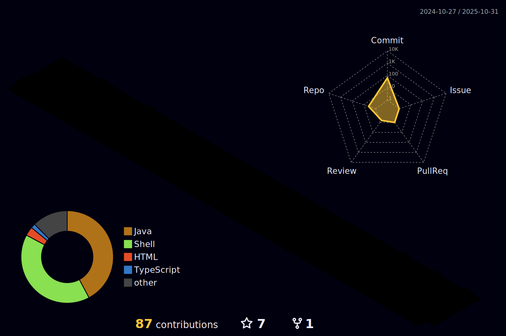

  

  <samp>
    <b>Full-Stack Engineer who learns by asking "how does this actually work?"</b> 
    Not by memorizing syntax.
  </samp>

 

 I'm the guy who shuts up, investigates, and solves the problem. 
 And when I can't? I'm humble enough to ask for help.
 

 

 Computer Technician (2019) → IT Technician (2021) → Software Engineer (2023) 
 <b>Now seeking:</b> Senior Full-Stack roles (remote only)
 

 

 <i>I don't build my career on buzzwords. I build it on understanding systems. 
 And yeah, I still check the docs. That's called engineering, not Googling.</i>
 

<!-- 
 -->
<!--    -->
<!-- 
 -->

  

## 🛠️ What I Actually Use

### Core (Day-to-day)

### Also Work With

 

  

 

## 🌎 Find me at

 

